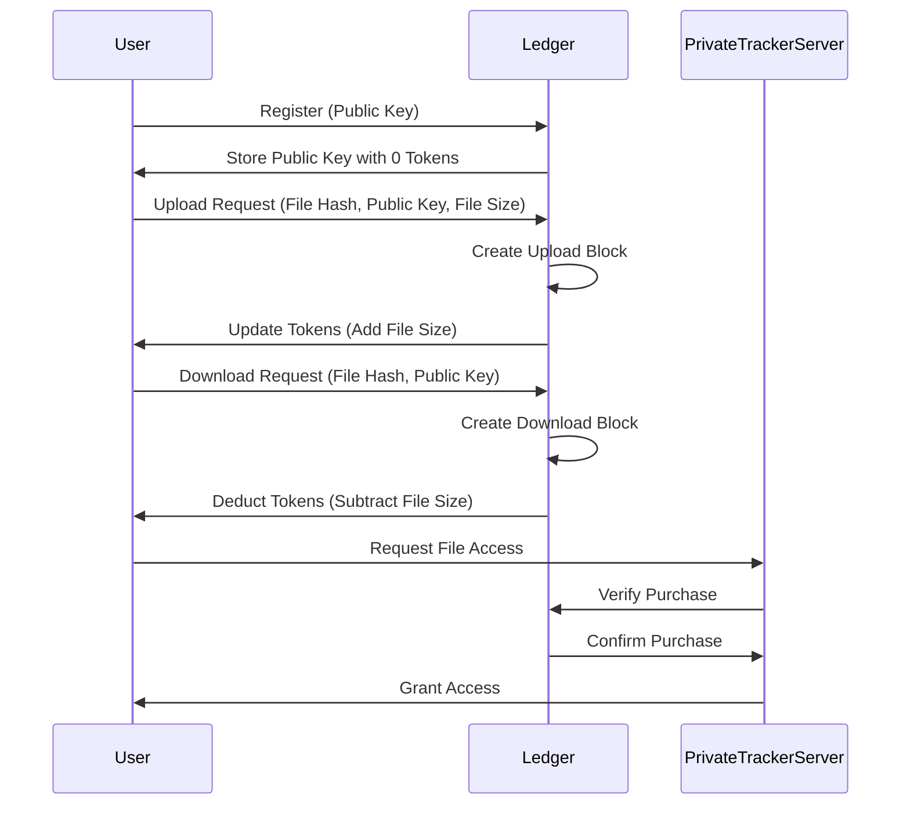
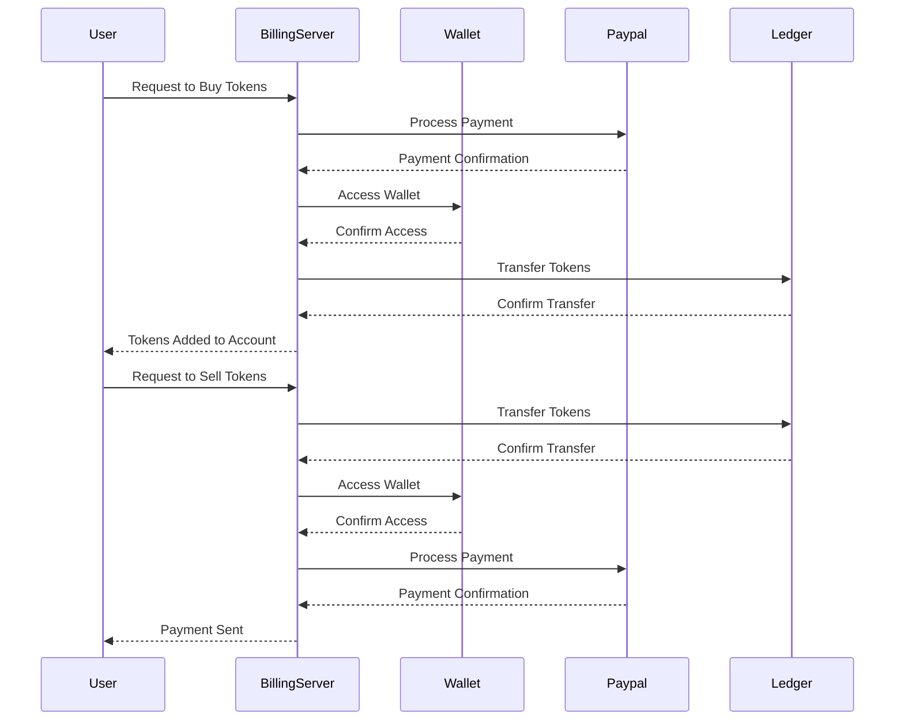

# DigitalLib

This is the Proposed Architecture for the Peer to Peer exam for a Digital Library using Peer to Peer technology.

## Architecture Diagram

```mermaid

```

## Api Spec

```mermaid
sequenceDiagram
    participant User
    participant UserBackend
    participant FileBackend

    User ->> UserBackend: GET /api/register<br>{ "public_key": "user_public_key" }
    UserBackend -->> User: { "registered": true }

    User ->> FileBackend: GET /api/search<br>{ "query": "file_query" }
    FileBackend -->> User: [{ "filename": "file_name", "size": file_size, "hash": "file_hash" }]

    User ->> FileBackend: GET /api/download<br>{ "hash": "file_hash", "signed_hash": "signed_file_hash" }
    FileBackend -->> User: <torrent file>

    User ->> FileBackend: GET /api/upload<br>{ "hash": "file_hash", "signed_hash": "signed_file_hash" }
    FileBackend -->> User: <torrent file>
```

### GET /api/register

This endpoint is available on the *User Backend*.

The registering of a user is done client side by generating a public/private key pair and sending the public key to the server.

**params**:

```json
{
  "public_key": "string"
}
```

**response**:

```json
{
  "registered": "boolean"
}
```

### GET /api/search

This endpoint is available on the *File Backend*.

This route takes a query and returns a list of files that match the query.

**params**:

```json
{
  "query": "string",
}
```

**response**:

```json
[
  {
    "filename": "string",
    "size": "number",
    "hash": "string",
  }
]
```

### GET /api/download

This endpoint is available on the *File Backend*.

The endpoint takes a file hash and a signed hash.

The signed hash is a hash of the file hash and the user's public key, identifying the user for this query, making sure the user is in possession of it's private key.

The response is a torrent file configured to use the private bitorrent tracker with a session token for the user to download the file.

**params**:

```json
{
  "hash": "string",
  "signed_hash": "string",
  "public_key": "string"
}
```

**response**:

```
<torrent file>
```

### GET /api/upload

This endpoint is available on the *File Backend*.

The endpoint takes a file hash and a signed hash.

The signed hash is a hash of the file hash and the user's public key, identifying the user for this query, making sure the user is in possession of it's private key.

The response is a torrent file configured to use the private bitorrent tracker with a session token for the user to seed the file.

**params**:

```json
{
  "hash": "string",
  "signed_hash": "string",
  "public_key": "string"
}
```

**response**:

```
<torrent file>
```

## Ledger Spec

We introduce a Ledger to the system to keep track of the download/upload ratio of each user. When registering a user, the user's public key is stored in the ledger with 0 tokens (upload/download ratio of 0).

When the user makes an upload request, we store a new **upload** block containing the file hash, the user's public key and the size of the file. The Ledger will then update the user's account with the number of tokens equal to the size of the file.

When the user makes a download request, the user needs to create a **download** block on the ledger with the file hash and the user's public key that will cost the user a number of tokens equal to the size of the file.

The Private Tracker Server will then verify that the user has bought the file and give him access.



## Monetisation

We introduce a Billing Server that has access to a wallet full of money.

This allows a user to buy tokens using Paypal or to sell tokens using Paypal.

The Billing Server will then transfer the tokens to the user's account in the Ledger, creating a **buy**/**sell** block.



## Privacy and Data Protection

### Privacy

The system has a privacy focused design.
The user's identity is it's public key.

The only information stored on the ledger is the user's public key and the number of tokens the user has.

The only possible way to identify a user is to look at the Paypal transactions of a user and correlate the timestamps of the transactions with the timestamps of the ledger transactions.

### Data Protection

We issue a simple HTTPS certificate to all the backends as is is the only connections that hold private information.

## Digital Library Interconnection

Wa can use the Synapse protocol to interconnect Bitorrent Libraries. We can then allow the user to transfer coins from a blockchain to another blockchain.

## Possible Attacks
